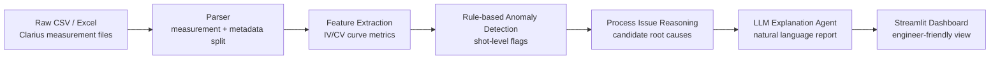

# Wafer AI Analyst

> AI-assisted wafer electrical test analysis agent for shot-level anomaly detection and semiconductor process issue reasoning.

**Wafer AI Analyst**는 반도체 웨이퍼 전기 측정 데이터를 자동으로 정리하고, 소자별 IV/CV curve에서 핵심 feature를 추출한 뒤, shot 단위 이상 징후와 가능한 공정 이슈 후보를 설명하는 AI 품질 분석 프로젝트입니다.

이 프로젝트는 단순한 그래프 시각화가 아니라, **반도체 측정 데이터 분석 workflow**와 **LLM 기반 AI Agent 활용**을 연결하는 것을 목표로 합니다.

## 1. Project Motivation

반도체 제조 현장에서는 wafer, shot, die 단위로 많은 전기 측정 데이터가 발생합니다. 엔지니어가 모든 CSV/Excel 파일과 curve를 직접 확인하면 시간이 오래 걸리고, 측정 오류나 공정 편차 후보를 놓칠 수 있습니다.

이 프로젝트는 아래 질문에서 출발했습니다.

```text
측정 장비에서 나온 raw data를 자동으로 정리하고,
어느 shot이 이상한지,
그 이상이 어떤 공정 이슈와 연결될 수 있는지
AI가 설명해줄 수 있을까?
```

## 2. What This Project Does



핵심 기능은 다음과 같습니다.

- Raw CSV/Excel measurement file parsing
- Shot/device 자동 분류
- Diode, resistor, capacitor, NMOS feature extraction
- Rule-based anomaly detection
- 공정 이슈 후보 mapping
- LLM 기반 설명 생성 구조
- Streamlit dashboard 기반 분석 UI

## 3. Dataset

분석 대상 데이터는 wafer shot 단위 전기 측정값입니다.

| Device | Data Type | Main Columns | Analysis Target |
|---|---|---|---|
| Diode | I-V curve | `AnodeI`, `AnodeV`, `IFIT` | forward current, fitting mismatch, shot variation |
| Resistor | I-V curve | `AI`, `AV` | resistance, linearity, saturation |
| Capacitor | C-V curve | `C`, `V`, `G_or_R` | capacitance variation, invalid measurement point |
| NMOS | Id-Vg curve | `DrainI`, `GateI`, `GateV` | compliance limit, gate leakage, current response |

현재 데이터는 다음 특성을 가집니다.

- CSV measurement files: diode, resistor, capacitor, NMOS
- Excel measurement file: multi-sheet diode shot data
- Shot-level labels: 예시 `1-1`, `1-4`, `5-1`, `5-4`, `9-1`, `9-4`, `7-3`, `7-2`, `5-3`, `5-2`, `3-3`, `3-2`
- Raw data는 실험 데이터 보호를 위해 GitHub에 업로드하지 않고, `data/raw/`에서 로컬로 분석합니다.

## 4. Semiconductor Analysis Logic

이 프로젝트는 전기적 측정값을 단순 수치로 보지 않고, 가능한 공정 이슈 후보와 연결합니다.

| Electrical Pattern | Candidate Issue | Engineering Interpretation |
|---|---|---|
| Diode current differs by shot | Junction variation, contact issue, CD variation | 같은 diode 구조가 shot 위치에 따라 다르게 동작할 가능성 |
| Diode measured curve differs from fitting curve | Non-ideal diode behavior, contact instability | 이상적인 diode 모델과 실제 측정값 사이의 차이 |
| Resistor I-V curve loses linearity | Contact resistance, current saturation | 저항 소자가 정상적인 직선 응답을 보이지 않을 가능성 |
| Capacitor has physically unrealistic values | Measurement error, probe issue, data artifact | 실제 물리값보다 장비/저장 오류 가능성 |
| NMOS drain current sticks near current limit | Compliance limit, short suspect, measurement condition issue | 장비 전류 제한 때문에 실제 curve가 왜곡될 가능성 |

중요한 점은, 이 프로젝트가 공정 원인을 단정하지 않는다는 것입니다.

> 목표는 **root cause 확정**이 아니라, 전기적 증거를 기반으로 **가능한 원인 후보를 좁히고 추가 확인 방향을 제시**하는 것입니다.

## 5. AI Agent Concept

이 프로젝트에서 AI는 모델을 무리하게 학습시키는 방식이 아니라, **분석 결과를 해석하고 보고서화하는 Agent**로 사용됩니다.

예상 입력:

```json
{
  "device": "diode",
  "shot": "7-2",
  "i_at_2v_a": 1.51e-7,
  "anomaly_flags": ["curve_fit_mismatch"],
  "process_issue_candidates": [
    "junction characteristic variation",
    "contact instability",
    "non-ideal diode behavior"
  ]
}
```

예상 출력:

```text
7-2 shot의 diode 측정에서 fitting curve와 실제 측정 curve 사이의 차이가 관찰되었습니다.
이는 접합 특성 편차, probe contact 불안정, 또는 비이상적인 diode 동작 가능성을 시사합니다.
현재 데이터만으로 공정 원인을 확정할 수는 없으므로, 동일 shot 반복 측정과 reverse bias leakage 측정을 추가로 권장합니다.
```

## 6. Current Implementation

현재 구현된 기능입니다.

```text
src/wafer_ai_analyst/parsers.py
  - Clarius-style CSV parser
  - Multi-sheet diode Excel parser
  - device / shot inference

src/wafer_ai_analyst/features.py
  - diode feature extraction
  - resistor resistance extraction
  - capacitor feature extraction
  - NMOS compliance/leakage feature extraction

src/wafer_ai_analyst/rules.py
  - measurement_error_suspect
  - compliance_limit_suspect
  - current_saturation_suspect
  - curve_fit_mismatch

src/wafer_ai_analyst/process_reasoning.py
  - anomaly flag -> process issue candidate mapping

app.py
  - Streamlit dashboard skeleton
```

## 7. Quick Start

```bash
git clone https://github.com/JuHyeon-Nam/wafer-ai-analyst.git
cd wafer-ai-analyst

python -m venv .venv
source .venv/bin/activate
pip install -r requirements.txt
```

원본 데이터를 `data/raw/`에 넣은 뒤 실행합니다.

```bash
python -m src.wafer_ai_analyst.cli \
  --input data/raw \
  --output data/processed/features.csv
```

대시보드 실행:

```bash
streamlit run app.py
```

## 8. Example Output Schema

CLI 실행 결과는 shot/device 단위 feature table로 저장됩니다.

```text
device, shot, rows, i_at_2v_a, ifit_mae_a, anomaly_flags, process_issue_candidates
diode, 7-2, 201, 1.51e-7, 1.09e-8, curve_fit_mismatch, junction characteristic variation...
Cap, 1-4, 104, ..., measurement_error_suspect, probe contact issue...
NMOS, 5-1, 124, ..., compliance_limit_suspect, measurement condition issue...
```

## 9. Tech Stack

| Area | Stack | Purpose |
|---|---|---|
| Language | Python | 데이터 파싱, 수치 계산, 분석 workflow |
| Data Handling | pandas, numpy | CSV/Excel 정제, feature extraction |
| Excel Parsing | openpyxl | multi-sheet diode measurement file 처리 |
| Visualization | plotly | IV/CV curve와 feature 시각화 |
| Dashboard | Streamlit | 분석 결과를 웹 UI로 제공 |
| AI Agent | LLM API planned | 자연어 분석 리포트 생성 |
| Version Control | Git/GitHub | 기능 단위 개발 이력 관리 |

## 10. Roadmap

- [x] Project structure and GitHub repository setup
- [x] CSV/Excel parser
- [x] Device-level feature extraction
- [x] Rule-based anomaly detection
- [x] Process issue candidate mapping
- [ ] LLM explanation prompt module
- [ ] Streamlit dashboard polish
- [ ] Curve viewer for each device/shot
- [ ] Automated HTML report generation
- [ ] Portfolio demo screenshots

## 11. Portfolio Positioning

이 프로젝트는 다음 두 역량을 동시에 보여주기 위한 포트폴리오입니다.

### Semiconductor Experience

```text
Wafer shot 단위 전기 측정 데이터를 분석하며 diode, resistor, capacitor, NMOS의 IV/CV curve 특성을 비교하고,
전기적 이상 징후를 leakage, contact issue, compliance limit, capacitance abnormality 등 가능한 품질 이슈 후보와 연결했습니다.
```

### AI Application Experience

```text
LLM 기반 AI Agent를 활용해 반도체 측정 데이터의 anomaly result와 process issue candidates를 자연어 리포트로 변환하는 workflow를 설계했습니다.
```

### Data Engineering Experience

```text
장비 raw CSV/Excel 파일에서 measurement block과 metadata를 분리하고,
shot/device 단위 structured feature table로 변환하는 분석 파이프라인을 구축했습니다.
```

## 12. Limitations

현재 데이터만으로 실제 공정 불량 원인을 확정할 수는 없습니다. 실제 root cause analysis를 위해서는 다음 데이터가 추가로 필요합니다.

- 공정 recipe
- 온도/압력/시간 조건
- 증착 두께
- 식각 조건
- 도핑 조건
- SEM/광학 이미지
- 반복 측정 데이터
- 실제 불량 label

따라서 이 프로젝트는 **공정 원인 확정 시스템**이 아니라, **전기 측정 데이터 기반의 AI-assisted engineering review tool**로 정의합니다.

## 13. Repository Guide

GitHub 협업자 추가, repository 설정, 커밋 메시지 예시는 아래 문서에 정리되어 있습니다.

- [`docs/GITHUB_SETUP.md`](docs/GITHUB_SETUP.md)
- [`docs/PROJECT_PLAN.md`](docs/PROJECT_PLAN.md)

