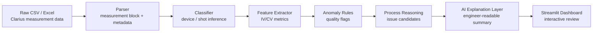

# Wafer AI Analyst

> AI-assisted semiconductor wafer electrical test analysis system for shot-level quality review and process issue reasoning.


## Overview

**Wafer AI Analyst**는 반도체 웨이퍼 전기 측정 데이터를 자동으로 정리하고, 소자별 IV/CV curve에서 핵심 feature를 추출한 뒤, shot 단위 이상 징후와 가능한 공정 이슈 후보를 제시하는 분석 시스템입니다.

측정 장비에서 나온 raw CSV/Excel 파일은 사람이 바로 해석하기 어렵습니다. 파일마다 소자 종류, shot 정보, 측정값, 장비 metadata가 섞여 있고, IV/CV curve를 직접 확인해야 하는 경우가 많습니다.

이 프로젝트는 그 과정을 자동화합니다.

```text
Raw measurement files
-> Data parsing
-> Device/shot classification
-> Electrical feature extraction
-> Anomaly rule check
-> Process issue candidate reasoning
-> AI explanation-ready report
-> Dashboard visualization
```

## Team

| Name | Affiliation | Main Contribution Area |
|---|---|---|
| 임유경 | 한국기술교육대학교 메카트로닉스공학부 | Wafer shot 구조 이해, 측정 공정 흐름 정리, 공정 이슈 후보 해석 |
| 임채진 | 한국기술교육대학교 정보통신공학과 | 데이터 처리 흐름, dashboard 구성, 분석 결과 시각화 |
| 최규상 | 한국기술교육대학교 전기공학과 | Diode/NMOS/resistor/capacitor 전기적 feature 정의 및 해석 |
| 남주현 | 인하대학교 소프트웨어공학과 | Python 분석 파이프라인, AI Agent workflow, GitHub 프로젝트 구조 설계 |

모든 팀원은 데이터 구조 파악, 분석 기준 정리, 결과 해석, 문서화 과정에 함께 참여했습니다.

## Problem Definition

반도체 제조와 테스트 과정에서는 wafer, shot, device 단위로 많은 전기 측정 데이터가 생성됩니다. 엔지니어는 다음과 같은 문제를 자주 마주합니다.

- 측정 파일이 많아 수작업 확인 시간이 오래 걸림
- CSV/Excel 안에 측정값과 장비 조건이 섞여 있음
- 같은 소자라도 shot 위치에 따라 전기적 특성이 달라짐
- 이상값이 실제 공정 문제인지, 측정 오류인지 빠르게 구분해야 함
- 분석 결과를 다른 팀원이 이해할 수 있는 형태로 설명해야 함

Wafer AI Analyst는 이 문제를 해결하기 위해, 전기 측정 데이터를 자동 정제하고 shot 단위 품질 상태를 빠르게 검토할 수 있는 분석 workflow를 제공합니다.

## System Architecture



## Dataset

분석 대상은 wafer shot 단위 전기 측정 데이터입니다.

| Device | Measurement | Main Columns | Extracted Features |
|---|---|---|---|
| Diode | I-V curve | `AnodeI`, `AnodeV`, `IFIT` | `I@1V`, `I@2V`, max current, fitting error |
| Resistor | I-V curve | `AI`, `AV` | resistance, linearity, current saturation count |
| Capacitor | C-V curve | `C`, `V`, `G_or_R` | `C@0V`, max/min capacitance, invalid point count |
| NMOS | Id-Vg curve | `DrainI`, `DrainV`, `GateI`, `GateV` | drain current span, gate leakage, compliance suspect |

Raw data는 실험 데이터 보호를 위해 GitHub에 포함하지 않습니다. 로컬 환경에서는 `data/raw/` 폴더에 측정 파일을 넣고 분석합니다.

## Key Features

### 1. Raw Data Parsing

Clarius 계측 장비에서 export된 CSV 파일은 위쪽에 실제 측정값이 있고, 아래쪽에 측정 조건 metadata가 붙어 있습니다. Parser는 이 둘을 분리합니다.

```text
CSV file
-> measurement table
-> measurement metadata
-> device name
-> shot label
```

Excel 파일은 여러 sheet에 shot별 diode 측정값이 들어 있는 구조를 처리합니다.

### 2. Device-Level Feature Extraction

소자별로 품질 판단에 필요한 feature를 계산합니다.

| Device | Feature Meaning |
|---|---|
| Diode | 같은 전압에서 전류가 얼마나 흐르는지, fitting curve와 얼마나 다른지 확인 |
| Resistor | I-V curve가 직선에 가까운지, 계산된 저항값이 shot별로 다른지 확인 |
| Capacitor | capacitance 값이 물리적으로 정상 범위인지, 이상 측정점이 있는지 확인 |
| NMOS | drain current가 장비 전류 제한에 걸렸는지, gate leakage가 큰지 확인 |

### 3. Rule-Based Anomaly Detection

초기 버전은 소량의 실제 측정 데이터에서도 안정적으로 동작하도록 rule-based 방식으로 이상 후보를 탐지합니다.

| Anomaly Flag | Trigger Example | Meaning |
|---|---|---|
| `measurement_error_suspect` | capacitor 값이 비정상적으로 큼 | 장비 오류값, probe contact 문제, 저장 오류 가능성 |
| `compliance_limit_suspect` | NMOS drain current가 제한값 근처에 고정 | 장비 compliance limit 또는 short 가능성 |
| `current_saturation_suspect` | resistor 전류가 특정 값 이상에서 포화 | 접촉 저항 변화 또는 측정 조건 영향 가능성 |
| `curve_fit_mismatch` | diode 측정 curve와 fitting curve 차이가 큼 | 비이상적인 diode 동작 또는 접촉 불안정 가능성 |

### 4. Process Issue Reasoning

전기적 이상 징후를 가능한 공정/측정 이슈 후보와 연결합니다.

| Electrical Pattern | Candidate Issue | Interpretation |
|---|---|---|
| Diode current differs by shot | Junction variation, contact issue, CD variation | 같은 diode 구조가 shot 위치에 따라 다르게 동작 |
| Diode curve differs from fitting curve | Non-ideal diode behavior, contact instability | 이상적인 diode 모델과 실제 측정값 사이의 차이 |
| Resistor linearity decreases | Contact resistance, current saturation | 저항 소자가 정상적인 직선 응답을 보이지 않음 |
| Capacitor has unrealistic value | Measurement error, probe issue, data artifact | 물리값보다 장비/저장 오류 가능성 |
| NMOS current sticks near limit | Compliance limit, short suspect | 장비 전류 제한으로 실제 curve가 왜곡될 가능성 |

이 시스템은 공정 원인을 단정하지 않습니다. 전기적 증거를 바탕으로 가능한 원인 후보를 좁히고, 추가 확인 방향을 제시하는 engineering review tool입니다.

### 5. Dashboard

Streamlit 기반 dashboard는 다음 화면을 목표로 합니다.

- 데이터 폴더 입력
- device/shot별 feature table
- anomaly flag 확인
- 공정 이슈 후보 확인
- IV/CV curve viewer
- AI 설명 리포트 표시

## Project Structure

```text
wafer-ai-analyst/
  app.py
  requirements.txt
  README.md
  data/
    raw/
    processed/
  docs/
    GITHUB_SETUP.md
    PROJECT_PLAN.md
  reports/
    figures/
  src/
    wafer_ai_analyst/
      parsers.py
      features.py
      rules.py
      process_reasoning.py
      cli.py
```

## Tech Stack

| Category | Stack | Usage |
|---|---|---|
| Language | Python | 분석 파이프라인과 dashboard 구현 |
| Data Processing | pandas, numpy | CSV/Excel 정제, 수치 계산, feature extraction |
| Excel Handling | openpyxl | multi-sheet diode Excel 파일 처리 |
| Visualization | plotly | IV/CV curve와 shot별 feature 시각화 |
| Dashboard | Streamlit | 사용자 입력과 분석 결과 화면 구성 |
| AI Layer | LLM prompt workflow | 분석 결과를 자연어 설명으로 변환 |
| Version Control | Git, GitHub | 팀 개발 이력 관리 |

## Quick Start

```bash
git clone https://github.com/JuHyeon-Nam/wafer-ai-analyst.git
cd wafer-ai-analyst

python -m venv .venv
source .venv/bin/activate
pip install -r requirements.txt
```

원본 측정 데이터를 `data/raw/`에 넣은 뒤 feature table을 생성합니다.

```bash
python -m src.wafer_ai_analyst.cli \
  --input data/raw \
  --output data/processed/features.csv
```

Dashboard를 실행합니다.

```bash
streamlit run app.py
```

## Example Output

CLI 실행 결과는 shot/device 단위 feature table로 저장됩니다.

```text
device,shot,rows,i_at_2v_a,ifit_mae_a,anomaly_flags,process_issue_candidates
diode,7-2,201,1.51e-7,1.09e-8,curve_fit_mismatch,junction characteristic variation...
Cap,1-4,104,...,measurement_error_suspect,probe contact issue...
NMOS,5-1,124,...,compliance_limit_suspect,measurement condition issue...
```

## Development Roadmap

- [x] GitHub repository setup
- [x] Project directory structure
- [x] CSV parser for Clarius-style measurement files
- [x] Excel parser for multi-sheet diode data
- [x] Device-level electrical feature extraction
- [x] Rule-based anomaly detection
- [x] Process issue candidate mapping
- [ ] Streamlit dashboard refinement
- [ ] Device/shot curve viewer
- [ ] AI explanation prompt module
- [ ] Automated HTML report generation
- [ ] Demo screenshots and result documentation

## Engineering Notes

현재 데이터만으로 실제 공정 불량 원인을 확정할 수는 없습니다. 실제 root cause analysis에는 공정 recipe, 온도/압력/시간 조건, 증착 두께, 식각 조건, 도핑 조건, SEM/광학 이미지, 반복 측정 데이터가 추가로 필요합니다.

따라서 Wafer AI Analyst는 다음 목적에 초점을 둡니다.

```text
전기 측정 데이터에서 이상 징후를 찾고,
가능한 공정/측정 이슈 후보를 좁히고,
엔지니어가 다음 확인 방향을 빠르게 판단하도록 돕는다.
```

## References

- [`docs/PROJECT_PLAN.md`](docs/PROJECT_PLAN.md)
- [`docs/GITHUB_SETUP.md`](docs/GITHUB_SETUP.md)

