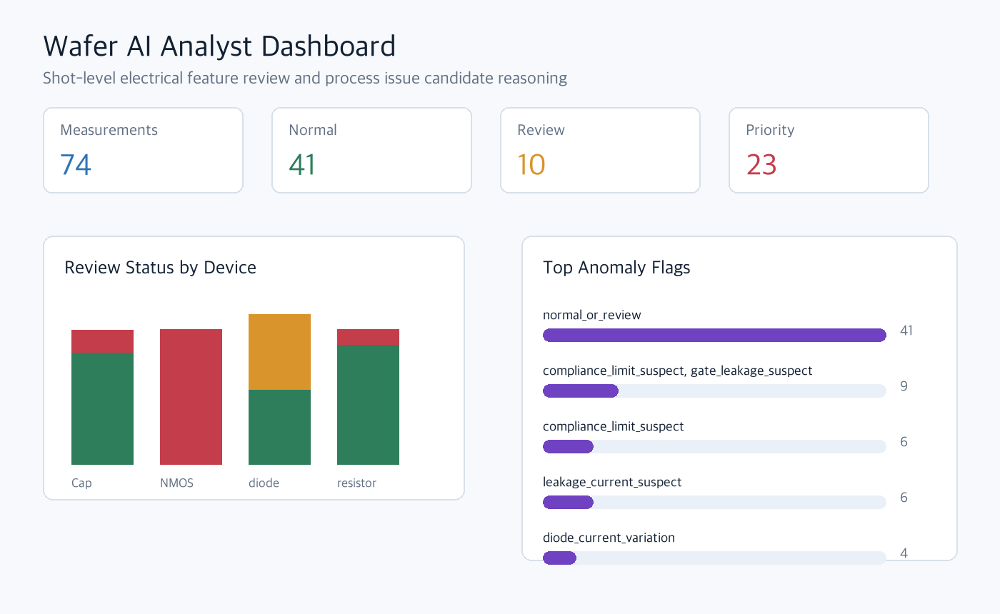
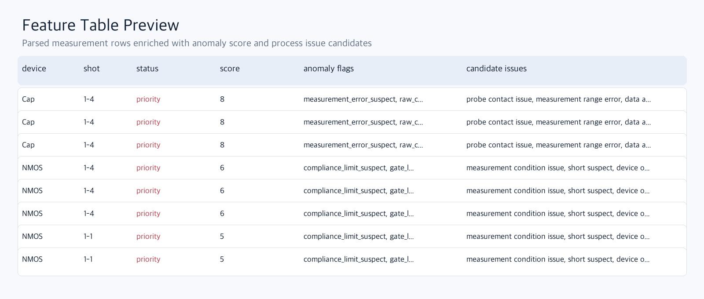

<h1 align="center">Wafer AI Analyst</h1>

<p align="center">
  <b>AI-assisted wafer electrical test analysis workflow</b><br/>
  Raw measurement parsing · Shot-level anomaly review · Process issue candidate reasoning
</p>

<p align="center">
  
  
  
</p>

<p align="center">
  
  
  
  
  
  
  
</p>

## Overview

**Wafer AI Analyst**는 반도체 웨이퍼 전기 측정 데이터를 자동으로 정리하고, diode/resistor/capacitor/NMOS 소자별 electrical feature를 추출한 뒤, shot 단위 이상 징후와 가능한 공정/측정 이슈 후보를 제시하는 분석 시스템입니다.

측정 장비에서 export된 CSV/Excel 파일에는 실제 측정값, 장비 조건, sheet 정보, shot 정보가 섞여 있습니다. 이 프로젝트는 raw data를 분석 가능한 table로 바꾸고, 이상 후보를 `normal`, `review`, `priority`로 분류한 뒤, 결과를 dashboard와 explanation agent에서 확인할 수 있게 구성했습니다.

```text
Raw CSV / Excel
-> Parser
-> Feature table
-> Rule-based anomaly detection
-> Process issue candidate mapping
-> Explanation agent
-> Streamlit dashboard
```

## Dashboard Preview





## Team

### 남주현 | Team Lead

`인하대학교 소프트웨어공학과`


- Python 기반 wafer data analysis pipeline 설계
- CSV/Excel parser, feature extraction, anomaly workflow 연결
- explanation agent 구조, dashboard 흐름, GitHub 개발 이력 관리

### 임유경

`한국기술교육대학교 메카트로닉스공학부`


- wafer shot 구조와 측정 공정 흐름 정리
- probe contact, measurement range, compliance 등 공정/장비 이슈 후보 정리
- 비전공자도 이해 가능한 분석 설명 검토

### 임채진

`한국기술교육대학교 정보통신공학과`


- 분석 결과 table과 dashboard view 구성
- shot/device별 review status 시각화 설계
- measurement별 explanation 결과 표시 흐름 정리

### 최규상

`한국기술교육대학교 전기공학과`


- diode, resistor, capacitor, NMOS electrical feature 정의
- IV/CV curve 기반 anomaly rule 기준 정리
- 전기적 이상 징후와 공정 이슈 후보 연결 검토

## Dataset

분석 대상은 wafer shot 단위 전기 측정 데이터입니다. Raw data는 실험 데이터 보호를 위해 GitHub에 포함하지 않습니다.

| Device | Measurement | Main Columns | Extracted Features |
|---|---|---|---|
| Diode | I-V curve | `AnodeI`, `AnodeV`, `IFIT` | `I@0V`, `I@1V`, `I@2V`, fitting error, leakage suspect |
| Resistor | I-V curve | `AI`, `AV` | resistance, conductance, I-V linearity, compliance hit count |
| Capacitor | C-V curve | `C`, `V`, `G_or_R` | `C@0V`, capacitance range, invalid point count, raw outlier |
| NMOS | Id-Vg curve | `DrainI`, `DrainV`, `GateI`, `GateV` | drain current span, gate leakage, compliance suspect |

## Current Implementation

| Layer | Implemented |
|---|---|
| Data ingestion | Clarius-style CSV parser, multi-sheet diode Excel parser |
| Metadata handling | measurement table과 metadata table 분리, `measurement_id` 생성 |
| Curve normalization | 여러 파일의 IV/CV curve를 하나의 long-format curve table로 정리 |
| Feature extraction | 소자별 electrical feature 계산 |
| Anomaly detection | rule-based flag, `anomaly_score`, `review_status` 생성 |
| Process reasoning | anomaly flag를 가능한 공정/측정 이슈 후보와 연결 |
| Explanation agent | 비전공자용 설명, 엔지니어용 설명, LLM prompt 생성 |
| Dashboard | Streamlit 기반 feature table, status chart, explanation view |
| Synthetic data | 실제 feature 분포를 참고한 defect scenario feature generator |
| ML dataset prep | train/test split, feature column selection, validation report |
| ML baseline | RandomForest defect classifier training and evaluation |
| ML tuning | 72개 parameter 조합 비교, tuned RandomForest model selection |

## Anomaly Logic

초기 분석은 데이터 수와 label이 제한적인 상황을 고려해 rule-based baseline으로 구현했습니다. 이는 현업에서도 데이터 구조를 이해하고 기준선을 잡을 때 자주 사용하는 접근입니다.

| Anomaly Flag | Trigger Example | Review Meaning |
|---|---|---|
| `measurement_error_suspect` | capacitor invalid point 존재 | 측정 오류, probe contact, 저장 artifact 가능성 |
| `raw_capacitance_outlier` | raw capacitance가 물리 범위를 벗어남 | CV range 오류, open contact, parsing artifact 가능성 |
| `compliance_limit_suspect` | NMOS drain current가 장비 제한 근처에 고정 | compliance limit 또는 short path 가능성 |
| `current_saturation_suspect` | resistor current가 high-current 구간에서 포화 | contact resistance 또는 측정 조건 영향 가능성 |
| `curve_fit_mismatch` | diode 측정 curve와 fitting curve 차이가 큼 | 비이상적 diode 동작 또는 contact 불안정 가능성 |
| `leakage_current_suspect` | diode low-bias current가 큼 | junction leakage, surface contamination 가능성 |
| `gate_leakage_suspect` | NMOS gate leakage가 큼 | gate oxide, surface leakage, probe contact 가능성 |
| `resistor_linearity_drop` | resistor I-V 선형성이 낮음 | contact resistance, self-heating, compliance 영향 가능성 |

## Technology Choices

| Stack | Why It Was Used | Troubleshooting Point |
|---|---|---|
| Python | 데이터 parsing, feature 계산, dashboard, CLI를 한 언어로 연결하기 위해 사용 | 분석 모듈을 `parser -> feature -> rule -> explanation`으로 분리해 유지보수성 확보 |
| pandas | CSV/Excel처럼 표 형태인 측정 데이터를 정리하기 위해 사용 | measurement, metadata, curve, feature table을 분리해 column mismatch 문제 해결 |
| NumPy | IV/CV curve에서 interpolation, fitting, max/min/span 계산을 위해 사용 | NaN과 비정상 capacitor 값을 필터링해 계산 안정성 확보 |
| openpyxl | multi-sheet Excel diode file을 읽기 위해 사용 | `Settings` sheet는 측정값이 아니라 metadata로 따로 처리 |
| Rule-based logic | label 부족 상황에서 안정적인 baseline을 만들기 위해 사용 | 단순 threshold와 shot group median 비교를 함께 사용해 오탐을 줄임 |
| Streamlit | Python 코드만으로 빠르게 시연 가능한 dashboard를 만들기 위해 사용 | CLI 결과만으로는 흐름이 안 보여 status chart와 explanation view를 추가 |
| Plotly | shot/device별 분석 결과를 interactive chart로 보여주기 위해 사용 | 표 중심 결과를 chart와 함께 보여줘 review 우선순위를 쉽게 파악하게 구성 |
| Explanation agent | 숫자와 flag를 사람이 이해할 수 있는 문장으로 바꾸기 위해 사용 | root cause를 단정하지 않고 candidate issue로 표현하도록 설계 |
| scikit-learn | feature table 기반 RandomForest baseline 학습에 사용 | label leakage를 막기 위해 ID, 설명문, rule 결과를 feature에서 제외 |
| joblib | 학습된 model artifact 저장에 사용 | 모델 binary는 local output으로 관리하고 GitHub에는 재현 가능한 script와 report를 남김 |

## ML Model Expansion

현재 시스템은 rule-based anomaly detection과 explanation agent를 유지하면서, synthetic defect scenario dataset 기반 RandomForest classifier를 추가했습니다.

```text
Real wafer feature table
-> synthetic defect scenario generation
-> train/test split
-> RandomForestClassifier
-> hyperparameter tuning
-> accuracy / macro F1-score / confusion matrix
-> feature importance review
-> dashboard comparison with rule-based result
```

Model evaluation:

| Model | Train Accuracy | Test Accuracy | Test Macro F1 |
|---|---:|---:|---:|
| Baseline RandomForest | 0.9097 | 0.8819 | 0.8736 |
| Tuned RandomForest | 0.9618 | 0.9028 | 0.8960 |

Selected tuned model:

| Parameter | Selected Value |
|---|---:|
| `n_estimators` | `100` |
| `max_depth` | `None` |
| `min_samples_leaf` | `1` |
| `class_weight` | `None` |

튜닝 결과 test accuracy와 macro F1-score가 모두 개선되었습니다. 다만 `normal` class recall은 아직 낮아, 실제 공정 판단에서는 model prediction을 단정값이 아니라 review candidate로 사용하는 방향을 유지합니다.

Planned synthetic labels:

| Label | Pattern |
|---|---|
| `normal` | 정상 범위 feature |
| `diode_leakage` | low-bias diode current 증가 |
| `diode_contact_issue` | fitting error와 curve fluctuation 증가 |
| `resistance_shift` | resistor slope 변화 |
| `resistor_nonlinearity` | I-V linearity 저하 |
| `capacitance_variation` | shot별 capacitance shift |
| `capacitance_outlier` | CV raw value spike |
| `nmos_gate_leakage` | gate leakage 증가 |
| `nmos_compliance_limit` | drain current가 compliance 근처에서 제한 |

## Roadmap to 2026-08-20

| Date | Goal | Output |
|---|---|---|
| 2026-08-10 | README/project evidence 정리, dashboard preview asset 생성 | README refresh, dashboard/table preview images |
| 2026-08-11 | Synthetic defect scenario 설계 | scenario schema, synthetic feature generator |
| 2026-08-12 | Synthetic dataset 생성 및 검증 | ML-ready dataset, train/test split, validation report |
| 2026-08-13 | RandomForest baseline 학습 | training script, saved model artifact, baseline report |
| 2026-08-14 | 파라미터 튜닝 및 평가 | tuning result table, tuned model report |
| 2026-08-15 | Feature importance 분석 | device/defect별 중요 feature 정리 |
| 2026-08-16 | Dashboard ML prediction view 추가 | rule result와 ML prediction 비교 |
| 2026-08-17 | Curve viewer와 shot-level detail view 개선 | measurement detail review 화면 |
| 2026-08-18 | HTML/Markdown report 자동 생성 | analysis report artifact |
| 2026-08-19 | README, docs, demo scenario 정리 | final documentation pass |
| 2026-08-20 | End-to-end 검증 및 최종 정리 | reproducible demo and release notes |

## Quick Start

```bash
git clone https://github.com/JuHyeon-Nam/wafer-ai-analyst.git
cd wafer-ai-analyst

python -m venv .venv
source .venv/bin/activate
pip install -r requirements.txt
```

원본 측정 데이터를 `data/raw/`에 넣은 뒤 feature table을 생성합니다.

```bash
python -m src.wafer_ai_analyst.cli \
  --input data/raw \
  --output data/processed/features.csv \
  --metadata-output data/processed/metadata.csv \
  --curves-output data/processed/curves.csv \
  --explanations-output data/processed/explanations.csv
```

Dashboard를 실행합니다.

```bash
streamlit run app.py
```

README 이미지를 갱신할 때는 처리된 feature preview를 만든 뒤 asset generator를 실행합니다.

```bash
python scripts/generate_readme_assets.py \
  --input data/processed/features.csv
```

Synthetic defect scenario dataset을 생성합니다.

```bash
python scripts/generate_synthetic_dataset.py \
  --input data/processed/features.csv \
  --output data/processed/synthetic_features.csv \
  --scenario-output data/processed/synthetic_scenarios.csv \
  --samples-per-scenario 80
```

ML 학습용 dataset을 준비합니다.

```bash
python scripts/prepare_ml_dataset.py \
  --input data/processed/synthetic_features.csv \
  --output data/processed/ml_dataset.csv \
  --feature-columns-output data/processed/ml_feature_columns.txt \
  --report-output docs/SYNTHETIC_ML_DATASET_VALIDATION.md \
  --test-size 0.2
```

RandomForest baseline model을 학습합니다.

```bash
python scripts/train_random_forest.py \
  --input data/processed/ml_dataset.csv \
  --model-output models/random_forest_baseline.joblib \
  --report-output docs/RANDOM_FOREST_BASELINE.md \
  --predictions-output data/processed/rf_predictions.csv \
  --importance-output data/processed/rf_feature_importance.csv \
  --metrics-output data/processed/rf_metrics.json
```

RandomForest parameter tuning을 실행합니다.

```bash
python scripts/tune_random_forest.py \
  --input data/processed/ml_dataset.csv \
  --results-output data/processed/rf_tuning_results.csv \
  --report-output docs/RANDOM_FOREST_TUNING.md \
  --best-model-output models/random_forest_tuned.joblib \
  --best-report-output docs/RANDOM_FOREST_TUNED_MODEL.md \
  --best-predictions-output data/processed/rf_tuned_predictions.csv \
  --best-importance-output data/processed/rf_tuned_feature_importance.csv \
  --metrics-output data/processed/rf_tuned_metrics.json
```

## Engineering Boundary

현재 데이터만으로 실제 공정 불량 원인을 확정할 수는 없습니다. 실제 root cause analysis에는 공정 recipe, 온도/압력/시간 조건, 증착 두께, 식각 조건, 도핑 조건, SEM/광학 이미지, 반복 측정 데이터가 추가로 필요합니다.

따라서 이 시스템은 전기 측정 데이터에서 이상 징후를 찾고, 가능한 공정/측정 이슈 후보를 좁혀 엔지니어가 다음 확인 방향을 빠르게 판단하도록 돕는 review workflow입니다.

## Documents

- [`docs/DAY1_DATA_AUDIT.md`](docs/DAY1_DATA_AUDIT.md)
- [`docs/DAY2_PARSER_METADATA.md`](docs/DAY2_PARSER_METADATA.md)
- [`docs/DAY3_CURVE_NORMALIZATION.md`](docs/DAY3_CURVE_NORMALIZATION.md)
- [`docs/DAY4_FEATURE_ENGINEERING.md`](docs/DAY4_FEATURE_ENGINEERING.md)
- [`docs/DAY5_ANOMALY_RULES.md`](docs/DAY5_ANOMALY_RULES.md)
- [`docs/DAY6_PROCESS_REASONING.md`](docs/DAY6_PROCESS_REASONING.md)
- [`docs/DAY7_EXPLANATION_AGENT.md`](docs/DAY7_EXPLANATION_AGENT.md)
- [`docs/SYNTHETIC_DEFECT_SCENARIOS.md`](docs/SYNTHETIC_DEFECT_SCENARIOS.md)
- [`docs/ML_DATASET_PREPARATION.md`](docs/ML_DATASET_PREPARATION.md)
- [`docs/SYNTHETIC_ML_DATASET_VALIDATION.md`](docs/SYNTHETIC_ML_DATASET_VALIDATION.md)
- [`docs/RANDOM_FOREST_TRAINING.md`](docs/RANDOM_FOREST_TRAINING.md)
- [`docs/RANDOM_FOREST_BASELINE.md`](docs/RANDOM_FOREST_BASELINE.md)
- [`docs/RANDOM_FOREST_TUNING.md`](docs/RANDOM_FOREST_TUNING.md)
- [`docs/RANDOM_FOREST_TUNED_MODEL.md`](docs/RANDOM_FOREST_TUNED_MODEL.md)
- [`docs/PROJECT_PLAN.md`](docs/PROJECT_PLAN.md)
- [`docs/GITHUB_SETUP.md`](docs/GITHUB_SETUP.md)
